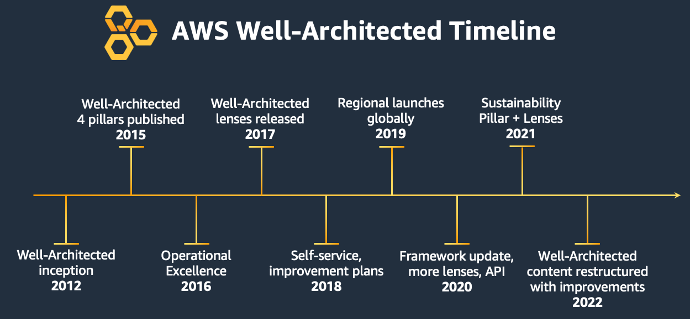

### Class Labs' URL

- [Class Lab Url](https://us-east-1.student.classrooms.aws.training/class/iiG4HCSAD2zRSpEQz2KfUD)

### Module 1

- [AWS Well-Architected Framework](https://docs.aws.amazon.com/wellarchitected/latest/framework/welcome.html/)

- [AWS Well-Architected Tool](https://aws.amazon.com/well-architected-tool/)

### Module 2

- [IAM Overview](https://docs.aws.amazon.com/IAM/latest/UserGuide/introduction.html)

- [IAM Best Practices](https://docs.aws.amazon.com/IAM/latest/UserGuide/best-practices.html)

- [How IAM Works?](https://docs.aws.amazon.com/IAM/latest/UserGuide/intro-structure.html)

- [Policy evaluation logic](https://docs.aws.amazon.com/IAM/latest/UserGuide/reference_policies_evaluation-logic.html)

- [AWS Organizations](https://docs.aws.amazon.com/IAM/latest/UserGuide/best-practices.html)

- [IAM and STS Demo](/iam/iam-sts-demo.md)

### Module 3

- [Get Disk Utilization of Your Fleet Using AWS Systems Manager Custom Inventory Types](https://aws.amazon.com/blogs/mt/get-disk-utilization-of-your-fleet-using-aws-systems-manager-custom-inventory-types/)

- [AWS Systems Manager Inventory](https://docs.aws.amazon.com/systems-manager/latest/userguide/systems-manager-inventory.html)

### Module 4

- [Best Practices for Tagging AWS Resources](https://docs.aws.amazon.com/whitepapers/latest/tagging-best-practices/tagging-best-practices.html)

- [AWS IP Address Manager (IPAM) – Simplify IP Address Management at Scale](https://aws.amazon.com/blogs/networking-and-content-delivery/aws-ip-address-manager-ipam-simplify-ip-address-management-at-scale/)

- [Revolutionizing Infrastructure Management: Amazon Q CLI for Modern Platform Engineering](https://builder.aws.com/content/2xdlcdeD6iqLGms0yoWMuijH8rc/revolutionizing-infrastructure-management-amazon-q-cli-for-modern-platform-engineering)

- [AWS Control Tower and AWS Organizations](https://docs.aws.amazon.com/organizations/latest/userguide/services-that-can-integrate-CTower.html)

- [AWS Control Tower User Guide](https://docs.aws.amazon.com/controltower/latest/userguide/what-is-control-tower.html)

### Module 5

- [CloudFormation in the AWS CLI Reference](https://docs.aws.amazon.com/cli/latest/reference/cloudformation/)

- [CloudFormation best practices](https://docs.aws.amazon.com/AWSCloudFormation/latest/UserGuide/best-practices.html)

- [Safely Handle Configuration Drift with CloudFormation Drift-Aware Change Sets](https://aws.amazon.com/blogs/devops/safely-handle-configuration-drift-with-cloudformation-drift-aware-change-sets/)

- [AWS Service Catalog User Guide](https://docs.aws.amazon.com/servicecatalog/latest/adminguide/what-is-service-catalog.html)

- [AWS Service Catalog Overview](https://aws.amazon.com/servicecatalog/)

### Module 6

- [AWS Systems Manager Automation](https://docs.aws.amazon.com/systems-manager/latest/userguide/systems-manager-automation.html)

- [AWS Systems Manager State Manager](https://docs.aws.amazon.com/systems-manager/latest/userguide/systems-manager-state.html)

- [AWS Systems Manager Patch Manager](https://docs.aws.amazon.com/systems-manager/latest/userguide/systems-manager-patch.html)

- [AWS Systems Manager Run Command](https://docs.aws.amazon.com/systems-manager/latest/userguide/systems-manager-run-command.html)

### Module 7

- [Elastic Load Balancer Documentation - AWS](https://aws.amazon.com/documentation-overview/elasticloadbalancing/)

- [Amazon Route 53 Documentation](https://aws.amazon.com/documentation-overview/route53/)

- [Failover routing - Amazon Route 53 - AWS Documentation](https://docs.aws.amazon.com/Route53/latest/DeveloperGuide/routing-policy-failover.html)

- [Routing traffic to an ELB load balancer - Amazon Route 53](https://docs.aws.amazon.com/Route53/latest/DeveloperGuide/routing-to-elb-load-balancer.html)

- [What is an Application Load Balancer? - AWS Documentation](https://docs.aws.amazon.com/elasticloadbalancing/latest/application/introduction.html)

- [Best practices for working with Amazon Route 53 - AWS Documentation](https://docs.aws.amazon.com/Route53/latest/DeveloperGuide/best-practices.html)

### Module 8

- [Amazon EC2 Auto Scaling - AWS Documentation](https://docs.aws.amazon.com/autoscaling/ec2/userguide/what-is-amazon-ec2-auto-scaling.html)

- [Target tracking scaling policies for Amazon EC2 Auto Scaling](https://docs.aws.amazon.com/autoscaling/ec2/userguide/as-scaling-target-tracking.html)

- [Step and simple scaling policies for Amazon EC2 Auto Scaling](https://docs.aws.amazon.com/autoscaling/ec2/userguide/as-scaling-simple-step.html)

- [AWS Auto Scaling - AWS Documentation](https://docs.aws.amazon.com/autoscaling/)

- [Predictive scaling for Amazon EC2 Auto Scaling](https://docs.aws.amazon.com/autoscaling/ec2/userguide/predictive-scaling-tutorial.html)

- [What is AWS License Manager? - AWS License Manager - AWS Documentation](https://docs.aws.amazon.com/license-manager/latest/userguide/license-manager.html)

### Module 9

- [Amazon CloudWatch Documentation](https://docs.aws.amazon.com/cloudwatch/)

- [Managing alarms - Amazon CloudWatch - AWS Documentation](https://docs.aws.amazon.com/AmazonCloudWatch/latest/monitoring/Manage-CloudWatch-Alarm.html)

- [Manually create or edit the CloudWatch agent configuration file - AWS Documentation](https://docs.aws.amazon.com/AmazonCloudWatch/latest/monitoring/CloudWatch-Agent-Configuration-File-Details.html)

- [Amazon EventBridge Documentation](https://docs.aws.amazon.com/eventbridge/)

- [What is AWS X-Ray? - AWS X-Ray](https://docs.aws.amazon.com/xray/latest/devguide/aws-xray.html)

- [CloudWatch Metrics Insights query syntax - AWS Documentation](https://docs.aws.amazon.com/AmazonCloudWatch/latest/monitoring/cloudwatch-metrics-insights-query-syntax.html)

### Module 10

  - [What is AWS Identity and Access Management (IAM)? - User Guide](https://www.google.com/search?q=https://docs.aws.amazon.com/iam/userguide/introduction.html)
  - [Welcome - IAM Access Analyzer - AWS Documentation](https://docs.aws.amazon.com/access-analyzer/latest/APIReference/Welcome.html)
  - [What is AWS Config? - AWS Config Documentation](https://aws.amazon.com/documentation-overview/config/)
  - [AWS Security Hub Documentation - Overview](https://aws.amazon.com/documentation-overview/security-hub/)
  - [Automating incident response in AWS Security Hub](https://www.google.com/search?q=https://docs.aws.amazon.com/securityhub/latest/userguide/securityhub-automation-actions.html)
  - [Working with Automation runbooks - AWS Systems Manager](https://docs.aws.amazon.com/systems-manager/latest/userguide/systems-manager-automation.html)

### Module 11

  - [What is Amazon VPC? - Amazon Virtual Private Cloud](https://docs.aws.amazon.com/vpc/latest/userguide/what-is-amazon-vpc.html)
  - [Working with VPC Flow Logs - Amazon VPC](https://docs.aws.amazon.com/vpc/latest/userguide/flow-logs.html)
  - [What is AWS WAF? - Web Application Firewall](https://aws.amazon.com/waf/faqs/)
  - [Amazon CloudFront Documentation - Overview](https://aws.amazon.com/documentation-overview/cloudfront/)
  - [What is AWS Certificate Manager (ACM)? - ACM FAQs](https://aws.amazon.com/certificate-manager/faqs/)
  - [VPC peering concepts - Amazon VPC](https://docs.aws.amazon.com/vpc/latest/peering/what-is-vpc-peering.html)

### Module 12

  - [Amazon EBS Introduction and Concepts - AWS Documentation](https://docs.aws.amazon.com/ebs/latest/userguide/ebs-volumes.html)
  - [Automate backups with Amazon Data Lifecycle Manager - AWS Documentation](https://docs.aws.amazon.com/ebs/latest/userguide/snapshot-lifecycle.html)
  - [What is Amazon Elastic File System (EFS)? - AWS Documentation](https://docs.aws.amazon.com/efs/latest/ug/whatisefs.html)
  - [Managing the lifecycle of file system data - Amazon EFS](https://docs.aws.amazon.com/efs/latest/ug/lifecycle-management-efs.html)
  - [What is AWS Backup? - AWS Documentation](https://www.google.com/search?q=https://docs.aws.amazon.com/backup/latest/devguide/whatisbackup.html)
  - [How AWS Backup works with Amazon EBS](https://www.google.com/search?q=https://docs.aws.amazon.com/backup/latest/devguide/backup-ebs.html)

### Module 13

  - [What is Amazon Simple Storage Service (S3)? - AWS Documentation](https://docs.aws.amazon.com/AmazonS3/latest/userguide/Welcome.html)
  - [Using Amazon S3 storage classes - AWS Documentation](https://docs.aws.amazon.com/AmazonS3/latest/userguide/storage-class-intro.html)
  - [Managing your storage lifecycle - Amazon S3](https://docs.aws.amazon.com/AmazonS3/latest/userguide/object-lifecycle-mgmt.html)
  - [Security in Amazon S3 - AWS Documentation](https://docs.aws.amazon.com/AmazonS3/latest/userguide/security.html)
  - [Blocking public access to your Amazon S3 storage - AWS Documentation](https://docs.aws.amazon.com/AmazonS3/latest/userguide/access-control-block-public-access.html)
  - [Overview of S3 Versioning - AWS Documentation](https://www.google.com/search?q=https://docs.aws.amazon.com/AmazonS3/latest/userguide/versioning-overview.html)
  - [Replicating objects - Amazon S3](https://docs.aws.amazon.com/AmazonS3/latest/userguide/replication.html)

### Module 14

  - [What is AWS Cost Explorer? - AWS Cost Management](https://docs.aws.amazon.com/cost-management/latest/userguide/ce-what-is.html)
  - [What is AWS Budgets? - AWS Cost Management](https://www.google.com/search?q=https://docs.aws.amazon.com/cost-management/latest/userguide/what-is-budgets.html)
  - [What are AWS Cost and Usage Reports?](https://www.google.com/search?q=https://docs.aws.amazon.com/cur/latest/userguide/what-are-cur.html)
  - [What is AWS Compute Optimizer?](https://docs.aws.amazon.com/compute-optimizer/latest/ug/what-is-compute-optimizer.html)
  - [Savings Plans Documentation](https://docs.aws.amazon.com/savingsplans/latest/userguide/what-is-savings-plans.html)
  - [Cloud Financial Management with AWS](https://aws.amazon.com/aws-cost-management/)

### Module 15

  - [AWS Well-Architected Framework Documentation](https://docs.aws.amazon.com/wellarchitected/latest/framework/welcome.html)
  - [Amazon Virtual Private Cloud Connectivity Options Whitepaper](https://docs.aws.amazon.com/whitepapers/latest/aws-vpc-connectivity-options/welcome.html)
  - [How AWS Pricing Works Whitepaper](https://docs.aws.amazon.com/whitepapers/latest/how-aws-pricing-works/abstract-and-introduction.html)
  - [AWS Certification - Validate AWS Cloud Skills](https://aws.amazon.com/certification/)
  - [AWS Training and Certification](https://aws.amazon.com/training/)
  - [AWS SkillBuilder - Online Learning Platform](https://skillbuilder.aws/)
  - [AWS Ramp-Up Guides](https://aws.amazon.com/training/ramp-up-guides/)

### Additional Resources about SAM and Lambda
  - [Sessions with SAM](https://www.youtube.com/playlist?list=PLJo-rJlep0ED198FJnTzhIB5Aut_1vDAd)
  - [The Complete AWS SAM Workshop](https://catalog.workshops.aws/complete-aws-sam/en-US)
  - [AWS CDK for Terraform](https://developer.hashicorp.com/terraform/cdktf)
  - [ AWS SAM application that implements a CRUD API with Lambda handlers written in Java](https://github.com/serdalkepil/aws-samples/tree/main/sam/java-crud-api-with-layer)

