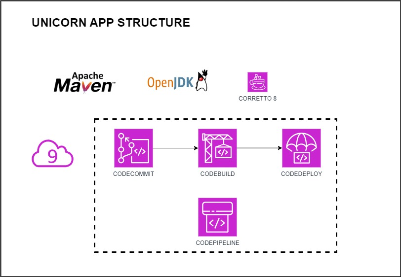
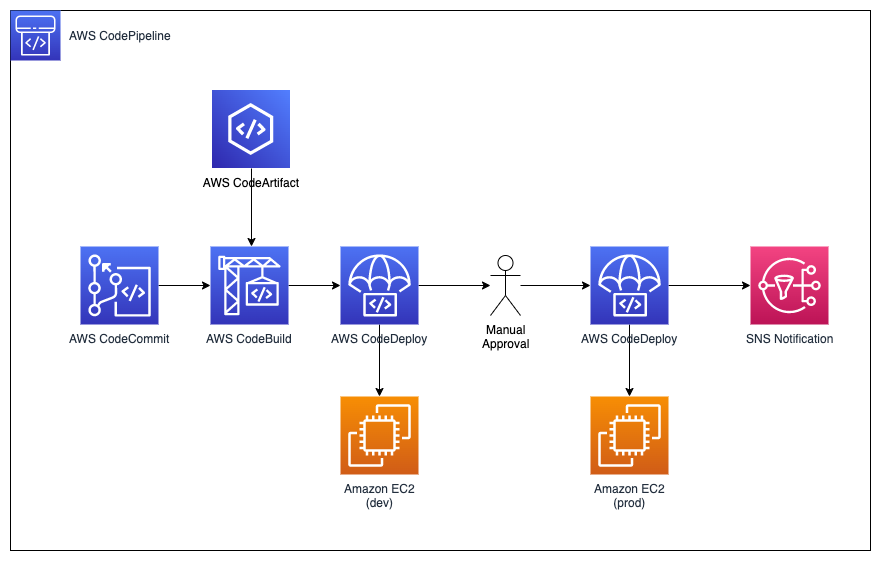

# UNICORN APP DEPLOYMENT



## Setup AWS Cloud9 IDE

Search for Cloud9 and then click Create environment.

Name the environment UnicornIDE and give a helpful description. Click Next step.

On the configure settings page select Create a new EC2 instance for environment. For the instance type select t2.micro and for the platform Amazon Linux 2. The remaining settings can be left as default.

Click Next step and then Create environment.

Cloud9 automatically creates a new EC2 instance in your AWS Account running the Cloud9 IDE software.

Once complete you should be presented with the Cloud9 IDE and a terminal prompt as shown below.

## Create a web app

Now that we have our Cloud9 development environment up and running, let's create our simple Java web application.

Install Maven & Java
Apache Maven  is a build automation tool used for Java projects. In this workshop we will use Maven to help initialize our sample application and package it into a Web Application Archive (WAR) file.

Install Apache Maven using the commands below (enter them in the terminal prompt of Cloud9):

```sh
sudo wget https://repos.fedorapeople.org/repos/dchen/apache-maven/epel-apache-maven.repo -O /etc/yum.repos.d/epel-apache-maven.repo
sudo sed -i s/\$releasever/6/g /etc/yum.repos.d/epel-apache-maven.repo
sudo yum install -y apache-maven
```

Maven comes with Java 7. For the build image that we're going to use later on we will need to use at least Java 8. Therefore we are going to install Java 8, or more specifically Amazon Correto 8 , which is a free, production-ready distribution of the Open Java Development Kit (OpenJDK) provided by Amazon:

```sh
sudo amazon-linux-extras enable corretto8
sudo yum install -y java-1.8.0-amazon-corretto-devel
export JAVA_HOME=/usr/lib/jvm/java-1.8.0-amazon-corretto.x86_64
export PATH=/usr/lib/jvm/java-1.8.0-amazon-corretto.x86_64/jre/bin/:$PATH
```

Verify that Java 8 and Maven are installed correctly:

```sh
java -version
mvn -v
```
Important
If the command above doesn't return openjdk version 1.8 (=> Java 8), then run the following command that allows you to choose the correct Java version:
`sudo alternatives --config java
`
## Create the Application
Use mvn to generate a sample Java web app

```sh
mvn archetype:generate \
    -DgroupId=com.wildrydes.app \
    -DartifactId=unicorn-web-project \
    -DarchetypeArtifactId=maven-archetype-webapp \
    -DinteractiveMode=false
```


Verify the folder structure has been created for the application. You should have index.jsp file and a pom.xml.

```sh
.
├── README.md
└── unicorn-web-project
    ├── pom.xml
    └── src
        └── main
            ├── resources
            └── webapp
                ├── index.jsp
                └── WEB-INF
                    └── web.xml

6 directories, 4 files
```

Modify the index.jsp file to customize the HTML code (just to make it your own!). You can modify the file by double-clicking on it in the Cloud9 IDE. We will be modifying this further to include the full Unicorn branding later.

```htm
<html>
<body>
<h2>Hello Unicorn World!</h2>
<p>This is my first version of the Wild Rydes application!</p>
</body>
</html>
```
## CodeCommit - Create the Repo

Log into the AWS Console and search for the CodeCommit service.

Click Create repository. Name it unicorn-web-project and give it a description. Also add a tag with key team and value devops.

On the next page select Clone URL and Clone HTTPS. This will copy the repository URL to the clipboard. The URL will have the following format:

`https://git-codecommit.<region>.amazonaws.com/v1/repos/<project-name>
`
Back in the Cloud9 environment setup your Git identity:
```sh
git config --global user.name "<your name>"
git config --global user.email <your email>

```
Make sure you are in the ~/environment/unicorn-web-project and init the local repo and set the remote origin to the CodeCommit URL you copied earlier:

```sh
cd ~/environment/unicorn-web-project
git init -b main
git remote add origin <HTTPS CodeCommit repo URL>
```
Now we can commit and push our code!

```sh
git add *
git commit -m "Initial commit"
git push -u origin main
```


## CodeBuild 

Log into the AWS Console and search for the CodeBuild service.

Under build projects select Create build project.

Name the project unicorn-web-build and set a helpful description. Below Additional configuration, add a tag with key team and value devops.

Under source select AWS CodeCommit as the source provider and select the unicorn-web-project as the repository. The branch should be main with no Commit ID.

Under environment choose to use a Managed image and select the following:
Operating System = Amazon Linux 2
Runtime = Standard
Image = aws/codebuild/amazonlinux2-x86_64-standard:corretto8
Image version = Always use the latest image for this runtime version
Environment Type = Linux

Choose to create a New service role and leave the Role name as default.

Under Buildspec leave the default option to Use a buildspec file which will look for a config file called buildspec.yml (we will create this later).

Under Artifacts select Amazon S3 and choose the bucket name created earlier. Set the name to unicorn-web-build.zip. Leave the other options as default ensuring the artifact packaging is set to Zip.

Finally, under Logs enable CloudWatch logs if it's not enabled yet. Set the group name to unicorn-build-logs and the stream name to webapp. This will allow us to track the output of our build in CloudWatch Logs.

Click create build project to finish!

### Create the buildspec.yml file

Now we have our build project setup we need to give it some instructions on how to build our application. To do this we will create a buildspec.yml (YAML) file in the root of the code repository.

Log back into the Cloud9 IDE.

Under the ~/environment/unicorn-web-project/ folder create a new file called buildspec.yml (naming must be exact!) and copy in the below contents. Make sure to replace the domain-owner account ID with your own account ID.

```yaml
version: 0.2

phases:
  install:
    runtime-versions:
      java: corretto8
  pre_build:
    commands:
      - echo Initializing environment
  build:
    commands:
      - echo Build started on `date`
      - mvn compile
  post_build:
    commands:
      - echo Build completed on `date`
      - mvn package
artifacts:
  files:
    - target/unicorn-web-project.war
  discard-paths: no
```

```sh
cd ~/environment/unicorn-web-project
git add *
git commit -m "Adding buildspec.yml file"
git push -u origin main
```

## Create an EC2 instance - CloudFormation

We are going to use AWS CloudFormation to provision a VPC and an EC2 instance to deploy our application to.

Log into the AWS Console and search for CloudFormation.

Download the provided CloudFormation YAML Template . ec2-cfn.yaml

In the CloudFormation Console, click Create stack > with new resources (standard).

Select Upload a template file and click Choose file. Select the yaml file downloaded in step 2 and click Next.

Name the stack UnicornStack and provide your IP address from http://checkip.amazonaws.com/  in the format 1.2.3.4/32 when prompted. Click through next accepting all the remaining defaults. Remember to acknowledge the IAM resources checkbox before clicking Create stack.

Wait for the stack to complete. This should take no longer than 5 minutes.

Once successful, search for "EC2" in the AWS Console and click on Instances (running). You should see once instance named UnicornStack::WebServer.


## Create CodeDeploy Configuration and Scripts

Log into the Cloud9 IDE.

Create a new folder scripts under ~/environment/unicorn-web-project/ .

Create a file install_dependencies.sh file in the scripts folder and add the following lines:

```sh
#!/bin/bash
sudo yum install tomcat -y
sudo yum -y install httpd
sudo cat << EOF > /etc/httpd/conf.d/tomcat_manager.conf
<VirtualHost *:80>
    ServerAdmin root@localhost
    ServerName app.wildrydes.com
    DefaultType text/html
    ProxyRequests off
    ProxyPreserveHost On
    ProxyPass / http://localhost:8080/unicorn-web-project/
    ProxyPassReverse / http://localhost:8080/unicorn-web-project/
</VirtualHost>
EOF
```

Create a start_server.sh file in the scripts folder and add the following lines:

```sh
#!/bin/bash
sudo systemctl start tomcat.service
sudo systemctl enable tomcat.service
sudo systemctl start httpd.service
sudo systemctl enable httpd.service
```

Create a stop_server.sh file in the scripts folder and add the following lines:

```sh
#!/bin/bash
isExistApp="$(pgrep httpd)"
if [[ -n $isExistApp ]]; then
sudo systemctl stop httpd.service
fi
isExistApp="$(pgrep tomcat)"
if [[ -n $isExistApp ]]; then
sudo systemctl stop tomcat.service
fi
```
CodeDeploy uses an application specification (AppSpec) file in YAML to specify what actions to take during a deployment, and to define which files from the source are placed where at the target destination. The AppSpec file must be named appspec.yml and placed in the root directory of the source code.

Create a new file appspec.yml in the ~/environment/unicorn-web-project/ folder and add the following lines:

```yaml
version: 0.0
os: linux
files:
  - source: /target/unicorn-web-project.war
    destination: /usr/share/tomcat/webapps/
hooks:
  BeforeInstall:
    - location: scripts/install_dependencies.sh
      timeout: 300
      runas: root
  ApplicationStart:
    - location: scripts/start_server.sh
      timeout: 300
      runas: root
  ApplicationStop:
    - location: scripts/stop_server.sh
      timeout: 300
      runas: root
```

To ensure that that the newly added scripts folder and appspec.yml file are available to CodeDeploy, we need to add them to the zip file that CodeBuild creates. This is done by modifying the artifacts section in the buildspec.yml like shown below:

```yaml
phases:
  [..]
  
artifacts:
  files:
    - target/unicorn-web-project.war
    - appspec.yml
    - scripts/**/*
  discard-paths: no
```

Now commit all the changes to CodeCommit:

```sh
cd ~/environment/unicorn-web-project
git add *
git commit -m "Adding CodeDeploy files"
git push -u origin main
```

### Create CodeDeploy service IAM Role

CodeDeploy requires a service role to grant it permissions to the desired compute platform. For EC2/On-Premises deployments you can use the AWS Managed AWSCodeDeployRole policy.

Log into the AWS Console and open the IAM console.

Choose Roles and then click Create role.

Choose CodeDeploy as the service and then select CodeDeploy for the use case. Click Next. CodeDeploy IAM Role

Accept the AWSCodeDeployRole default policy. Don't forget to take a look at the permissions this grants - in production you will want to be more granular!

Click Next and name the role UnicornCodeDeployRole. Click Create role to finish.

### Create a CodeDeploy application
Now that we have our required files in place, let's create a CodeDeploy application. An application is simply a name or container used by CodeDeploy to ensure that the correct revision, deployment configuration, and deployment group are referenced during a deployment.

Log into the AWS Console and search for CodeDeploy.

Click on Applications on the left-hand menu and select Create application.

Name the application unicorn-web-deploy and select EC2/On-premises as the Compute platform. Note the other options for AWS Lambda and Amazon ECS. Click Create application.

Create a deployment group
Next, let's create a deployment group, which contains settings and configurations used during the deployment. It defines for example that our deployment shall target any EC2 instances with a specific tag.

Under the unicorn-web-deploy application in the Deployment groups tab click Create deployment group.

Configure the following options:

```sh
Name = unicorn-web-deploy-group
Service role = arn:aws:iam::<aws-account-id>:role/UnicornCodeDeployRole
Deployment type = In-place
Environment configuration = Amazon EC2 instances
Tag group 1 Key = role
Tag group 1 Value = webserver
Install AWS CodeDeploy Agent = Now and schedule updates (14 days)
Deployment settings = CodeDeployDefault.AllAtOnce
Load balancer = Uncheck Enable load balancing (we just have one server)
```

### Create deployment
After creating our deployment group, i.e. defining the resources that we want to deploy, we can now create a deployment!

In the unicorn-web-deploy-group click Create deployment.

For the revision location use the S3 bucket created earlier:

```sh
s3://<my-artifact-bucket-name>/unicorn-web-build.zip

```

Leave the other settings as default and click Create deployment.

The deployment will now begin. Keep an eye on the deployment lifecycle events and check it completes successfully

Finally check that the web application is working by browsing to http://public-ip-address. You can get the public IP address from the instance details Networking tab. Remember that if you click the open address link this will default to https and needs to be changed to.


## Create the pipeline
Log into the AWS Console and search for the CodePipeline service.

Under Pipelines choose Create pipeline.

Enter unicorn-web-pipeline as the pipeline name. Choose to create a new service role and use the auto generated name. Leave other settings as default and click Next.

Under the source provider select AWS CodeCommit and select the unicorn-web-project as the repository. Set the branch name to be main. Leave the detection option as Amazon CloudWatch Events and the output artifact format to be CodePipeline default. Click Next.

On the build stage screen select AWS CodeBuild as the build provider and unicorn-web-build as the project name. Leave the build type as Single build. Click Next.

On the deploy stage screen select AWS CodeDeploy as the deploy provider and unicorn-web-deploy as the application name. Select unicorn-web-deploy-group as the deployment group. Click Next.

Review the pipeline settings and click Create pipeline. Once you click create, the whole pipeline will run for the first time. Ensure it completes successfully (this may take a few minutes).

## Release the final change

Congratulations, you now have a fully managed CI/CD pipeline! Let's test if everything is working.

Log back into your Cloud9 environment.

Update the index.jsp with the below html:

```htm
<!doctype html>

<html lang="en">
<head>
  <meta charset="utf-8">
  <style>
    body{
        font-family:'Segoe UI', Tahoma, Geneva, Verdana, sans-serif;
    }
    .site-header .title{
        background: url(images/wr-home-top.jpg) no-repeat top;
        background-size: cover;
        padding-bottom: 70.2753441802%;
        margin: 0;
        text-indent: -999em;
        position: relative;
    }
    .home-about {
        background: #f50856;
        color: #fff;
        padding: 5rem 0;
        text-align: center;
    }
    </style>
  <title>Wild Rydes</title>
</head>

<body>
    <header class="site-header">
        <h1 class="title">Wild Rydes</h1>
    </header>
    <section class="home-about">
        
        <h2 class="section-title">How Does This Work?</h2>
        <p class="content">
            In today's fast paced world, you've got places you need to be but not enough time in your jam packed schedule. Wouldn't it be nice if there were a transportation service that changed the way you get around daily? Introducing Wild Rydes, an innovative transportation service that helps people get to their destination faster and hassle-free. Getting started is as easy as tapping a button in our app.
        </p>
        <h2 class="section-title">Our Story</h2>
      <p class="content">
        Wild Rydes was started by a former hedge fund analyst and a software developer. The two long-time friends happened upon the Wild Rydes idea after attending a silent yoga retreat in Nevada. After gazing upon the majestic herds of unicorns prancing across a surreal Nevada sunset, they witnessed firsthand the poverty and unemployment endemic to that once proud race. Whether it was modern society's reliance on science over magic or not, we'll never know the cause of their Ozymandian downfall and fade to obscurity. Moved by empathy, romance, and free enterprise, they saw an opportunity to marry society's demand for faster, more flexible transportation to underutilized beasts of labor through an on-demand market making transportation app. Using the founders' respective expertise in animal husbandry and software engineering, Wild Rydes was formed and has since raised untold amounts of venture capital. Today, Wild Rydes has thousands of unicorns in its network fulfilling hundreds of rydes each day.
      </p>
    </section>
    

</body>
</html>
```
Download the background image  and save it to your local machine. Then create a new folder images below unicorn-web-project/src/main/webapp/images/ and upload the file via Cloud9 using File > Upload Local File...

Commit the changes using the command below:


```sh
cd ~/environment/unicorn-web-project/
git add *
git commit -m "Visual improvements to homepage"
git push -u origin main
```
## Add a dev stage, Extend the Dev


Update the CloudFormation stack
First, we will update our CloudFormation stack to include an additional EC2 instance which will act as our production server

Log into the AWS Console and go to the CloudFormation console.

Download the provided CloudFormation YAML Template .

In the CloudFormation console click on the UnicornStack and click Update.

Click Replace current template and upload the file downloaded from step 2.

Proceed with the next steps using Next until you arrive at the Review page.

Confirm the IAM changes and click Update stack. This will take a few minutes to complete.

Add an additional CodeDeploy deployment group
Now we need to add a production server deployment group in CodeDeploy

Log into the AWS Console and go to the CodeDeploy service.

Click on Applications and go to the unicorn-web-deploy application.

Under the deployment groups tab click Create deployment group.

Configure the following settings:

Deployment group name = unicorn-web-deploy-group-prod
Service role = UnicornCodeDeployRole
Deployment type = In-place
Environment configuration = Amazon EC2 instances
Tag group 1 Key = role
Tag group 1 Value = webserverprd
Install CodeDeploy Agent = Now and schedule updates (14 days)
Deployment configuration = CodeDeployDefault.AllAtOnce
Load balancer = Uncheck enable load balancing
Click Create deployment group.

