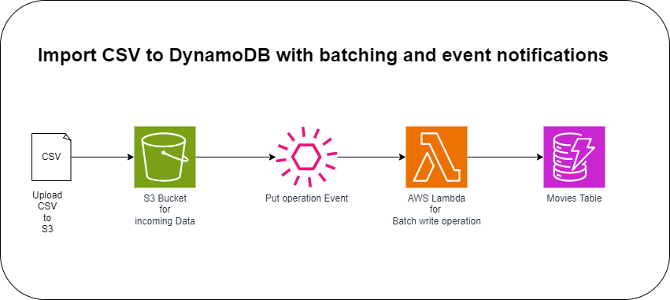

# Import CSV to DynamoDB with batching and event notifications

1. Create S3 Bucket

2. Create DynamoDB Table. 

    Table Name: Movies
    Partition Key: Year (N)
    Sort Key: Title (S)

3. Create IAM Policy and AWS Lambda Role

4. Create AWS Lambda Function qith Python 3.8 and allow S3 Event Notifications

5. Configure S3 Event Notification to invoke AWS Lambda for Put Events

6. Upload movies.csv file to S3 Bucket
