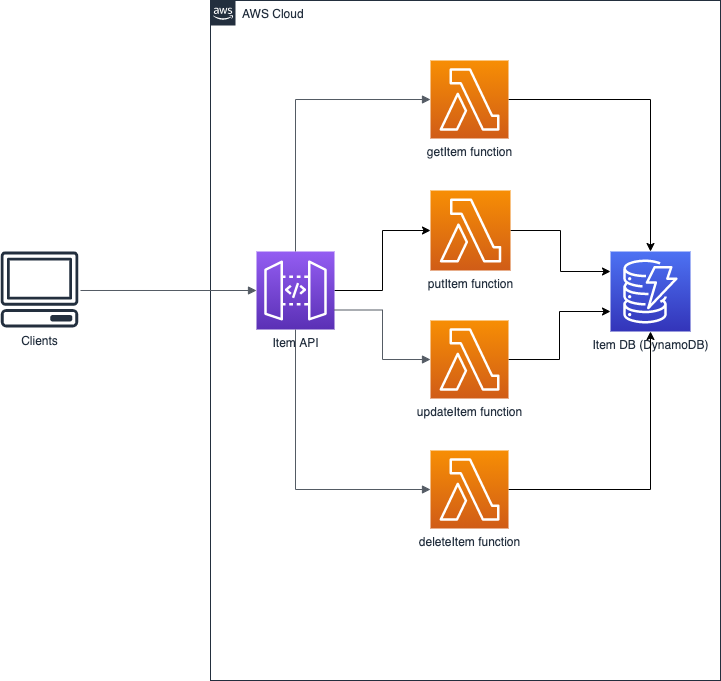

# aws-serverless-java-crud-api-sam-app

## About the application
It is an AWS SAM application that implements a CRUD API with Lambda handlers written in Java.

The architecture of the application is in the picture given below.



## Prerequisites
- Java 1.8+
- Apache Maven
- AWS CLI is installed and configured
- [AWS SAM CLI](https://docs.aws.amazon.com/serverless-application-model/latest/developerguide/serverless-sam-cli-install.html)

## Project structure

- [template.yaml](template.yaml) - The AWS SAM template, a descriptor of an AWS SAM application
- [codepipeline.yaml](codepipeline.yaml) - The AWS SAM Pipelines template, a CloudFormation template with definition of the AWS infrastructure for the automated Ci/CD
- [lambda-layer](lambda-layer/) - The Lambda Layer module that contains all the dependencies required for the Lambda functions
- [item-service-core](item-service-core/) - The Maven module that contains the common code of the Lambda functions. Is embedded into the layer as a Maven dependency
- [get-item-service](get-item-service/) - The Lambda function which implements the READ operation for the CRUD API
- [put-item-service](put-item-service/) - The Lambda function which implements the CREATE operation for the CRUD API
- [update-item-service](update-item-service/) - The Lambda function which implements the UPDATE operation for the CRUD API
- [delete-item-service](delete-item-service/) - The Lambda function which implements the DELETE operation for the CRUD API
- [pipeline](pipeline/) - The folder that contains the specifications for AWS SAM Pipelines that are used for the automated CI/CD
- [assume-role.sh](assume-role.sh) - The Bash script that is used for the automated CI/CD

## Build and deployment

To build and deploy with AWS SAM and Maven, please execute the sequence of the commands given below:
```
- cd item-service-core/
- mvn install
- cd ../lambda-layer/
- mvn install
- cd ..
- sam build 
- sam deploy --guided
```

## Connect your Git repository with the AWS CodePipeline

To connect your own Git repository with the AWS CodePiepline pipeline that is created from the [codepipeline.yaml](codepipeline.yaml) file, please use the command given below:
```
sam deploy -t codepipeline.yaml --stack-name <give-a-pipeline-stack-name> --capabilities=CAPABILITY_IAM
```
